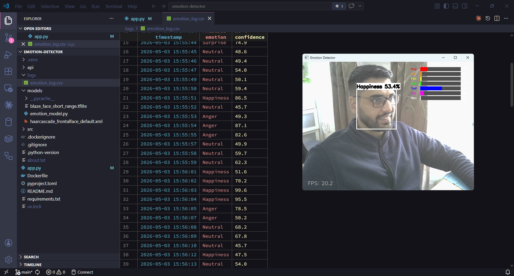
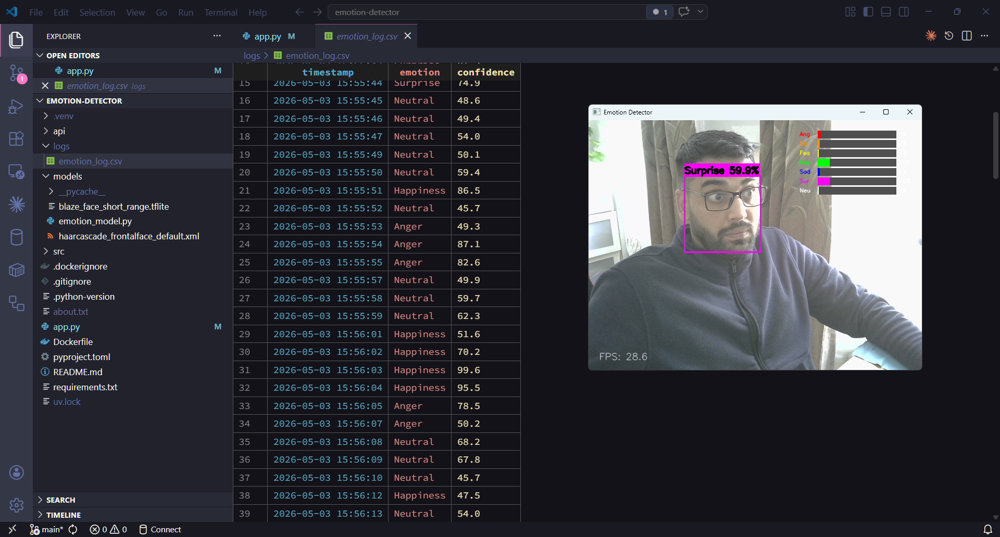

<div align='center'>

# Real-Time Emotion Detector


Real-time facial emotion detection system built with OpenCV, MediaPipe, and EfficientNet-B0. Detects faces via webcam and classifies 7 emotions with live confidence scores. Exposes a REST API containerised with Docker.

</div>

## 📸 Demo


## 🔍 How It Works

```
Webcam / Image
      ↓
MediaPipe BlazeFace — detects face location (x, y, w, h)
      ↓
OpenCV — crops and resizes face to 48x48 grayscale
      ↓
EfficientNet-B0 — classifies emotion (pretrained on AffectNet)
      ↓
Result — emotion label + confidence score + probability bars
```

## ⚙️ Tech Stack

| | Component | Technology |
|---|---|---|
| 👁️ | Face Detection | MediaPipe BlazeFace |
| 🧠 | Emotion Model | EfficientNet-B0 (AffectNet, 400k+ images) |
| 🎥 | Video Processing | OpenCV 4.x |
| 🔥 | Deep Learning | PyTorch 2.x |
| 🚀 | REST API | FastAPI + Uvicorn |
| 🐳 | Containerisation | Docker |
| 📦 | Package Manager | uv |


## 🎭 Emotions Detected

`😠 Anger` `🤢 Disgust` `😨 Fear` `😊 Happy` `😢 Sad` `😲 Surprise` `😐 Neutral`





## 📁 Project Structure

```
emotion-detector/
├── app.py                      # webcam real-time loop
├── api/
│   ├── main.py                 # FastAPI endpoints
│   └── schemas.py              # Pydantic response models
├── src/
│   ├── detector.py             # MediaPipe face detection
│   ├── emotion_analyzer.py     # EfficientNet inference
│   ├── utils.py                # drawing + low-light enhancement
│   └── logger.py               # CSV emotion logging
├── models/
│   ├── emotion_model.py        # model architecture
│   └── blaze_face_short_range.tflite
├── Dockerfile
└── pyproject.toml
```

## 🚀 Getting Started

### Option 1 — Run webcam app locally

Detects emotions in real time from your webcam. Displays bounding box, emotion label, confidence score, and probability bars on screen.

```bash
git clone https://github.com/harmandeep2993/facial-emotion-recognition.git
cd facial-emotion-recognition

# create and activate virtual environment
uv venv
.venv\Scripts\activate        # Windows
source .venv/bin/activate     # Mac / Linux

# install dependencies
uv sync

# run webcam app
python app.py
```

Press **Q** to quit.

---

### Option 2 — Run REST API locally

Starts a FastAPI server. Send an image file and receive emotion JSON response. Useful for integrating with a frontend or another service.

```bash
# same setup as above, then:
uvicorn api.main:app --reload
```

Open API docs at:
```
http://localhost:8000/docs
```

Upload any image via the Swagger UI and get emotion results back instantly.

---

### Option 3 — Run API with Docker

No setup needed. One command pulls the image and starts the server.

```bash
docker pull harmandeep2993/emotion-detector
docker run -p 8000:8000 harmandeep2993/emotion-detector
```

API docs available at:
```
http://localhost:8000/docs
```

## 📡 API Endpoints

| Method | Endpoint | Description |
|---|---|---|
| GET | `/health` | Health check |
| POST | `/analyze` | Upload image → get emotion JSON |

### Example response

```json
{
  "emotion": "Happy",
  "confidence": 87.3,
  "all_emotions": {
    "Anger": 1.2,
    "Disgust": 0.0,
    "Fear": 0.1,
    "Happy": 87.3,
    "Sad": 0.0,
    "Surprise": 4.1,
    "Neutral": 7.3
  },
  "faces_detected": 1
}
```

## 🔧 Key Implementation Details

**Low-light enhancement** — CLAHE applied to each frame before detection improves face detection in dim conditions.

**Frame skipping** — emotion analysis runs every 2nd frame with result caching to maintain smooth display on CPU.

**Confidence threshold** — predictions below 45% confidence are labelled "Uncertain" to avoid misleading results.

**Emotion logging** — detected emotions logged to CSV at 1-second intervals for downstream analysis.

**PyTorch 2.6 compatibility** — patches `torch.load` for `weights_only` breaking change in PyTorch 2.6.

## 📊 Performance

| Hardware | FPS |
|---|---|
| CPU (i5/i7) | 10–20 FPS |
| CPU (i3) | 5–10 FPS |
| GPU | 60+ FPS |

## 🗺️ Roadmap

- ☑ Real-time webcam detection
- ☑ MediaPipe BlazeFace face detection
- ☑ EfficientNet-B0 emotion classification
- ☑ Confidence threshold filtering
- ☑ Low-light enhancement (CLAHE)
- ☑ Emotion history logging to CSV
- ☑ FastAPI REST endpoint
- ☑ Docker containerisation
- ☐ Multi-face support
- ☐ WebSocket video streaming
- ☐ Deploy to Hugging Face Spaces

## 👤 Author

**Harmandeep Singh** | Data Scientist & ML Engineer | &nbsp;·&nbsp; [GitHub](https://github.com/harmandeep2993) &nbsp;·&nbsp; [LinkedIn](https://linkedin.com/in/harmandeep/)
